# Boas vindas ao repositório do projeto Cookmaster!

Você já usa o GitHub diariamente para desenvolver os exercícios, certo? Agora, para desenvolver os projetos, você deverá seguir as instruções a seguir. Fique atento a cada passo, e se tiver qualquer dúvida, nos envie por Slack! #vqv 🚀

Aqui você vai encontrar os detalhes de como estruturar o desenvolvimento do seu projeto a partir deste repositório, utilizando uma branch específica e um Pull Request para colocar seus códigos.

---

## Instruções para entregar seu projeto:

### ANTES DE COMEÇAR A DESENVOLVER:

1. Clone o repositório
  * `git clone https://github.com:tryber/sd-0x-cookmaster.git`.
  * Entre na pasta do repositório que você acabou de clonar:
    * `cd sd-0x-cookmaster`

2. Instale as dependências [**Caso existam**]
  * `npm install`

3. Crie uma branch a partir da branch `master`
  * Verifique que você está na branch `master`
    * Exemplo: `git branch`
  * Se não estiver, mude para a branch `master`
    * Exemplo: `git checkout master`
  * Agora crie uma branch à qual você vai submeter os `commits` do seu projeto
    * Você deve criar uma branch no seguinte formato: `nome-de-usuario-nome-do-projeto`
    * Exemplo: `git checkout -b joaozinho-cookmaster`

4. Adicione as mudanças ao _stage_ do Git e faça um `commit`
  * Verifique que as mudanças ainda não estão no _stage_
    * Exemplo: `git status` (deve aparecer listada a pasta _joaozinho_ em vermelho)
  * Adicione o novo arquivo ao _stage_ do Git
      * Exemplo:
        * `git add .` (adicionando todas as mudanças - _que estavam em vermelho_ - ao stage do Git)
        * `git status` (deve aparecer listado o arquivo _joaozinho/README.md_ em verde)
  * Faça o `commit` inicial
      * Exemplo:
        * `git commit -m 'iniciando o projeto x'` (fazendo o primeiro commit)
        * `git status` (deve aparecer uma mensagem tipo _nothing to commit_ )

5. Adicione a sua branch com o novo `commit` ao repositório remoto
  * Usando o exemplo anterior: `git push -u origin joaozinho-cookmaster`

6. Crie um novo `Pull Request` _(PR)_
  * Vá até a página de _Pull Requests_ do [repositório no GitHub](https://github.com/tryber/sd-0x-cookmaster/pulls)
  * Clique no botão verde _"New pull request"_
  * Clique na caixa de seleção _"Compare"_ e escolha a sua branch **com atenção**
  * Clique no botão verde _"Create pull request"_
  * Adicione uma descrição para o _Pull Request_ e clique no botão verde _"Create pull request"_
  * **Não se preocupe em preencher mais nada por enquanto!**
  * Volte até a [página de _Pull Requests_ do repositório](https://github.com/tryber/sd-0x-cookmaster/pulls) e confira que o seu _Pull Request_ está criado

---

# Entregáveis

Para entregar o seu projeto você deverá criar um Pull Request neste repositório.

Lembre-se que você pode consultar nosso conteúdo sobre [Git & GitHub](https://course.betrybe.com/intro/git/) sempre que precisar!

---

## O que deverá ser desenvolvido

Você vai desenvolver seu primeiro app utilizando a arquitetura MVC!

A aplicação a ser construída trata-se de um cadastro de receitas, onde será possível criar e visualizar receitas, seus ingredientes, e sua forma de preparo.

---

## Desenvolvimento

Você vai desenvolver todas as camadas da aplicação (Models, Views e Controllers) a partir do código deste repositório, que já possui a lógica necessária para realizar login e logout de usuários, bem como um middleware que você pode utilizar em todas as rotas que precisem de autenticação.

Através dessa aplicação, será possível realizar as operações básicas que se pode fazer em um determinado banco de dados: Criação, Leitura, Atualização e Exclusão (ou `CRUD`, pros mais íntimos 😜).

Para realizar qualquer tipo de alteração no banco de dados (como cadastro, edição ou exclusão de receitas) será necessário autenticar-se. Para visualizar receitas, a autenticação não é necessária.

O código para cadastro de usuários deve ser criado por você utilizando os conhecimentos adiquiridos nesse bloco.

⚠️ **Dicas Importantes** ⚠️:
- No código deste repositório, utilizamos o middleware `cookie-parser` para realizar a leitura do cookie contendo o token de autenticação. Ele é necessário para que o sistema de login / logout funcione. **Não o remova**!

- Você não precisa alterar a lógica de gerenciamento de sessões (login / logout de usuários).

- No `package.json`, você vai encontrar dois scripts que iniciam sua aplicação: `start` e `start:watch`. O primeiro, apenas inicia o servidor normalmente, enquanto o segundo inicia o servidor e o reinicia a cada alteração no código.

- O arquivo `models/userModel.js` está criado, mas não contém código para conexão com o banco. As funções existentes nele servem para _guardar lugar_ para algumas das funções que você deve criar. O papel de cada uma dessas funções está descrito nos comentários acima delas.

- O middleware `authMiddleware`, presente em `middlewares/auth.js` pode ser usado nas rotas que exigem autenticação.
  - Quando você utiliza o `authMiddleware` em uma rota, ele cria a propriedade `req.user`, que contém as informações do usuário atual, conforme retornadas pelo `userModel`.
  - O `authMiddleware` está disponível no `index.js` da aplicação através de `middlewares.auth`.

- Você pode modificar o layout das views que já existem. No entando, deve garantir que a funcionalidade continua a mesma.

- Nas aulas ao vivo e no conteúdo, você viu como realizar um `INSERT` no banco. Para realizar um `UPDATE` a lógica é a mesma. O que muda são os métodos a serem utilizados para construir o comando que será enviado ao MySQL.

- Quando o atributo `method` de um formulário é definido para `GET`, o navegador utiliza o atributo `name` de cada campo para montar a query string. Isso quer dizer que, se você quiser um atributo chamado `search` na query string, precisa de um input com `name="search"` no seu formulário.

- Toda vez que uma view precisar saber se existe ou não um usuário logado, você pode, no controller, passar o conteúdo de `req.user` para essa view. Depois, na view, basta verificar se esse campo veio preenchido ou não, utilizando algo como `<% if (user) { %> \<\!-- Utiliza os dados do usuário --\> <% } %>`.

- O middleware `authMiddleware` recebe um único parâmetro chamado `required`. Quando verdadeiro, esse parâmetro faz com que uma rota só possa ser acessada por pessoas logadas. Em alguns casos, uma página precisa ter acesso aos dados do usuário, caso essa pessoa esteja logada, mas deve continuar podendo ser acessada por pessoas que não estejam autenticadas. Para esse caso, passe `false` no parâmetro required para a função `authMiddleware`. Ex.: `middlewares.auth(false)`.

- Utilize `includes` do EJS para renderizar a navbar das páginas

- Parte do HTML ficará repetido em todas as páginas como, por exemplo, a barra de navegação.

- Para esses conteúdos repetitivos, você pode utilizar `includes` do EJS.

- A [documentação do EJS](https://ejs.co/#docs) (dê um Ctrl + F e pesquise por "includes") fala brevemente sobre o use de includes nas suas views.

### Data de Entrega

O projeto tem até a seguinte data: `DD/MM/YYYY - 14:00h`. Para ser entregue a avaliação final.

---

## Requisitos Obrigatórios:

### 💡Veja o exemplo a seguir de como o projeto pode se parecer depois de pronto. Lembre-se que você pode ~~e deve~~ ir além para deixar o projeto com a sua cara e impressionar à todos!

Você pode acessar um protótipo da aplicação com todas as telas (tanto obrigatórias quanto bônus) [neste link](https://www.figma.com/file/CAEkOBX1n3mpVXr4kjgvY8/Project-Cookmaster?node-id=0%3A1).

Não estamos avaliando o **estilo** da página. Cores, tamanhos de texto e afins não serão avaliados.

## ⚠️ Leia-os atentamente e siga à risca o que for pedido. ⚠️

Iremos apenas pedir que adicone data-testid em alguns elemetos, e algumas tags e textos especificos, então siga a risca o que iremos pedir nos requisitos, para que a automação funcione.

O não cumprimento de um requisito, total ou parcialmente, impactará em sua avaliação.

---

### 👀Observações importantes:

Haverá um arquivo chamado `cookmaster.sql` onde já contém a criação de do banco e alguns inserts.

Para rodar o arquivo basta rodar o comando 

`mysql -u root -p`

Isso fará com que abra o terminal do mysql depois basta executar o comando:

`source pasta_do_projeto/cookmaster.sql`

Assim já irá criar o banco e alguns inserts.

#### Funcionalidades de visualização

> As páginas abaixo podem ser acessadas sem login:

* Listagem de receitas
* Tela para visualizar uma receita específica
* Página de cadastro de usuários

### 1 - Crie uma tela de listagem de receitas.

A página deve ser acessível através da rota principal (`/`).

Para cada receita, deve ser mostrado apenas o nome da receita e o nome da pessoa que cadastrou aquela receita, bem como um link para ver seus detalhes.

Um botão "Nova receita" deve ser exibido **apenas quando houver um usuário logado**.

Tela home:

O página deverá ter o texto 'Cookmaster'.

O página deverá ter o texto 'Receitas'.

O link 'Ver mais' deverá ser utilizado o elemento `<a>Ver mais</a>`

O botão 'Nova Receita' deverá conter o data-testid="nova-receita".
(Esse botão deverá ficar visível na tela apenas estando logado.)

O botão 'Buscar Receita' deverá conter o data-testid="buscar-receita".
(Esse botão deverá ficar visível na tela estando logado ou não)

O 'Login' deverá conter a tag data-testid="login".

O 'Logout' deverá conter a tag data-testid="logout". 

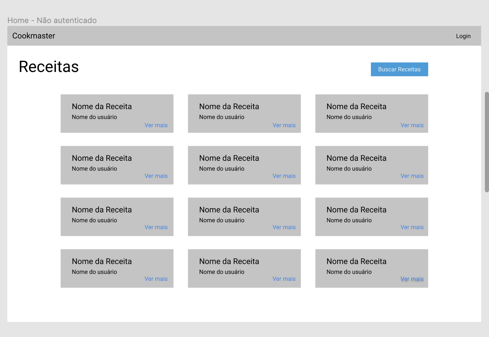

Tela de login:

A página deve ser acessível através da rota principal (`/login`). E deverá ser acessada pelo 'Login' da página Home.

O campo 'Email' deverá conter a tag data-testid="email".

O campo 'Senha' deverá conter a tag data-testid="senha".

O botão 'Login' deverá conter a tag data-testid="entrar".

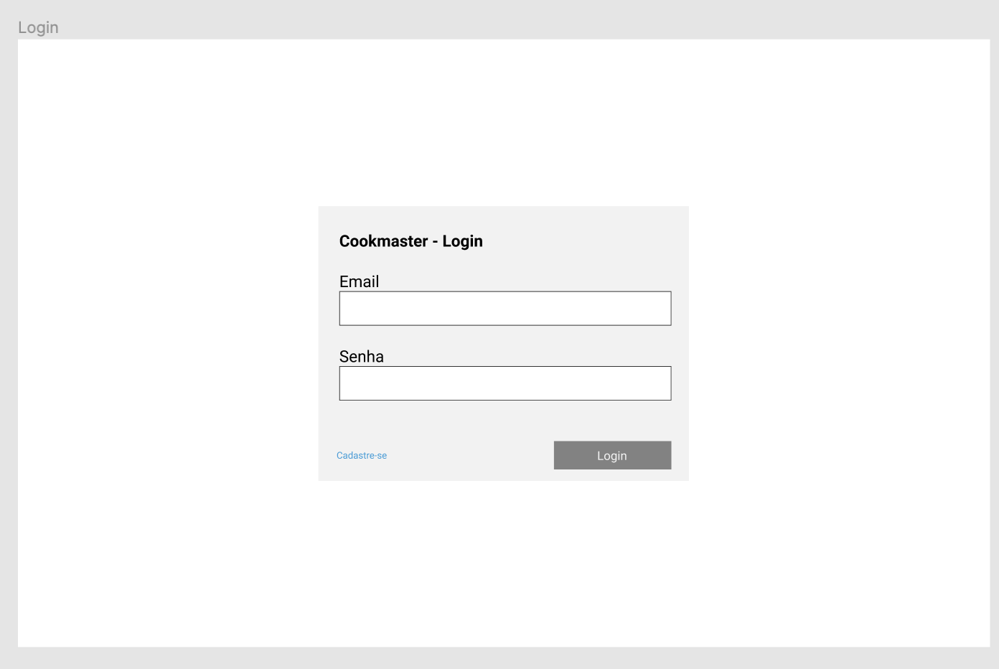

#### As seguintes verificações serão feitas:

**[Verificar se estou na home e tem os títulos 'Cookmaster' e 'Receitas'.]**

**[Verificar se não existe o botão 'Nova Receita' quando acesso home sem estar logado.]**

**[Verificar se existe o botão 'Nova Receita' quando estou logado e acessei a home.]**

**[Verificar se existe receita na tela com 'nome da receita', 'nome do usuário' e o link da receita 'Ver mais'.]**

### 2 - Crie uma página de cadastro de usuários.

Um usuário precisa ter os campos ID, E-mail, Senha, Nome e Sobrenome. Todos os campos são obrigatórios. O ID deve ser gerado automaticamente, não devendo ser preenchido pelo usuário no momento do cadastro.

A validação dos campos deve acontecer no backend, e uma mensagem deve ser enviada ao frontend através de uma propriedade passada para o EJS, da mesma forma que acontece com a view `users/login`.

**⚠️ Atenção ⚠️**: O sistema de autenticação espera que as funções `findUserByEmail` e `findUserById` retornem um objeto com, pelo menos, os campos `email`, `password` e `id`. Se você alterar o nome desses campos, precisará alterar o código de login.

Adicione na tela de login o botão ou link 'Cadastre-se' e deverá conter a tag data-testid="cadastrar".

Tela de Cadastro:

O campo 'Email' deverá conter a tag data-testid="email" 

O campo 'Senha' deverá conter a tag data-testid="senha"

O campo 'Confirmar Senha' deverá conter a tag data-testid="confirmar-senha" 

O campo 'Nome' deverá conter a tag data-testid="nome"

O campo 'Sobrenome' deverá conter a tag data-testid="sobrenome"

botao 'Cadastar-se' deverá conter a tag data-testid="cadastrar"

botao 'Login' deverá conter a tag data-testid="login"

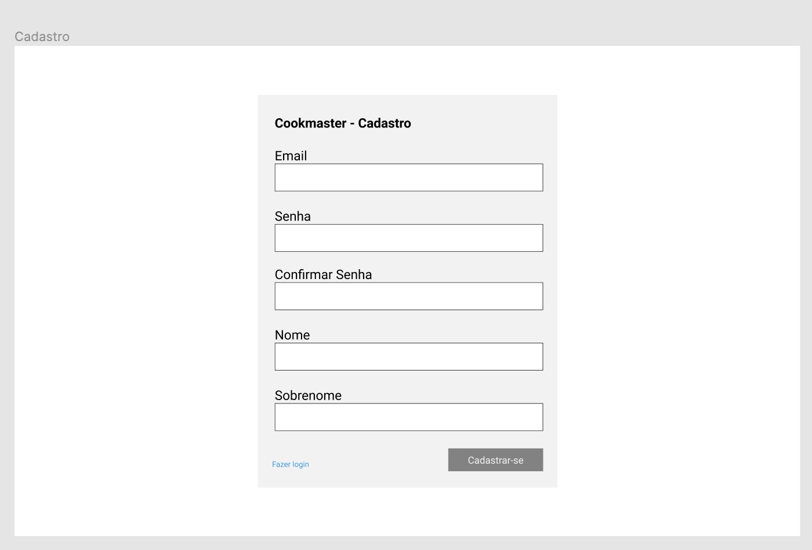

#### As seguintes verificações serão feitas:

**[Criar um usuário com sucesso.]**

- Ao cadastar o usário deverá aparecer a mensagem "Cadastro efetuado com sucesso!"

**[Validar o campo email.]**

- Ao cadastar um email inválido deverá aparecer a mensagem "O email deve ter o formato email@mail.com"

**[Validar o campo senha.]**

- Ao cadastar uma senha inválida deverá aparecer a mensagem "A senha deve ter pelo menos 6 caracteres"

**[Validar campos confirmar senha.]**

- Ao cadastar um confirmar senha inválida deverá aparecer a mensagem "As senhas tem que ser iguais"

**[Validar campos nome.]**

- Ao cadastar um nome inválido deverá aparecer a mensagem "O primeiro nome deve ter, no mínimo, 3 caracteres, sendo eles apenas letras"

**[Validar campos sobrenome.]**

- Ao cadastar um sobrenome inválido deverá aparecer a mensagem "O segundo nome deve ter, no mínimo, 3 caracteres, sendo eles apenas letras"

### 3 - Crie uma tela para visualizar uma receita específica.

A tela deve estar diponível no endpoint `/recipes/:id`

Caso o ID da pessoa logada na aplicação seja o mesmo ID da pessoa que criou a receita, um botão "Editar receita" e um outro "Excluir receita" devem ser exibidos na página. Esses botões devem levar a pessoa para as páginas e editar e de excluir receita, respectivamente. Caso não haja nenhuma pessoa logada, nenhum desses botões deve ser exibido.

Esta página deve exibir o título, os ingredientes, e a forma de preparo da receita.

> Dica: esse é um dos casos no qual você pode utilizar o `authMiddleware` passando `false` para o parâmetro `required`, e passar o conteúdo de `req.user` para a view, o que o permitirá determinar se existe um usuário logado e, portanto, se os botões devem ser exibidos.

Tela sem estar logado:

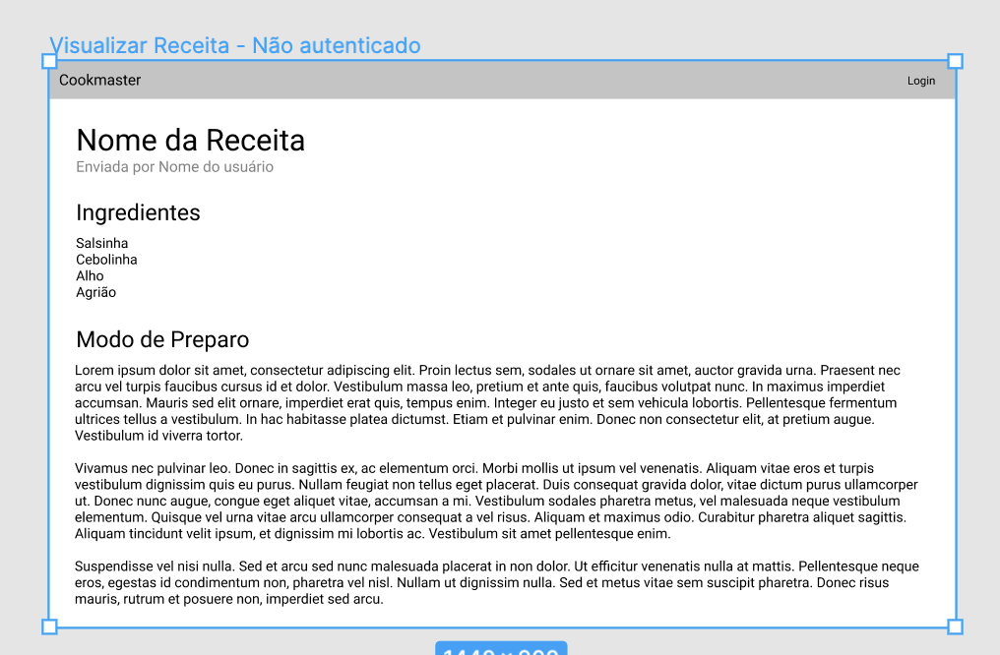

Tela sem estando logado:

O botão 'Editar Receita' deverá conter a tag data-testid="editar-receita"

O botão 'Excluir Receita' deverá conter a tag data-testid="excluir-receita"

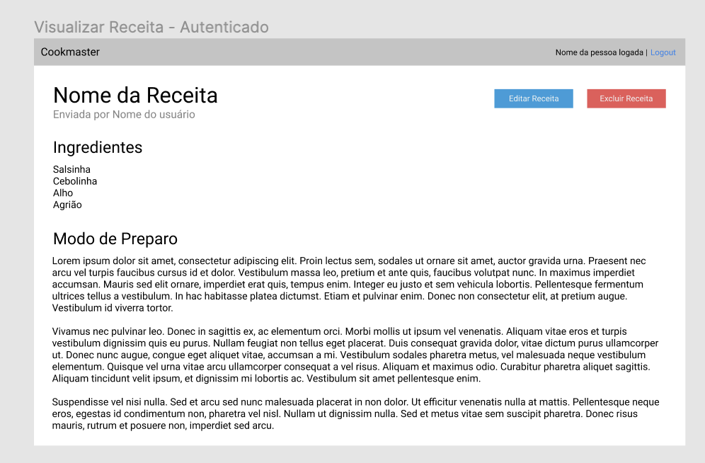

#### As seguintes verificações serão feitas:

**[Verificar se consigo acessar uma receita específica.]**

**[Verificar se consigo acessar uma receita específica depois que faço login.]**

**[Quando estou logado verfico se na página de uma receita específica existe os botões 'Editar Receita' e 'Excluir Receita'.]**

**[Verificar se na página da receita irá exibir o 'título da receita', os 'ingredientes', e a 'forma de preparo' da receita.]**

**[Verificar se o botão 'Editar Receita' leva para página de edição de receita.]**

**[Verificar se o botão 'Excluir Receita' leva para página de exclusão de receita.]**

**[Verificar se quando não estou logado os botões 'Editar Receita' e 'Excluir Receita' não podem estar visíveis na tela.]**

### 4 - Cria uma página de buscar de receitas.

A página deve estar acessível através do endpoint `/recipes/search`.

Um input do tipo texto deve ser exibido juntamente com um botão "Buscar". O conteúdo do input deve ser enviado para o endpoint `GET /recipes/search` através do parâmetro `q` na query string.

No backend, o valor do input de texto estará acessível através da propriedade `q` do objeto `req.query`. Caso nada seja informado para pesquisa, a view deve ser renderizada apenas com o campo de pesquisa. Caso um valor seja informado, uma lista semelhante à tela de listar receitas deve ser exibida, contendo o título, nome da pessoa que cadastrou, e um link para cada receita.

Para realizar a pesquisa, o controller de receitas deve solicitar ao model que pesquise por receitas **contendo em seu nome** o valor digitado no input de pesquisa.

Na Tela inicial('/') acidione o botão 'Buscar Receitas' deverá conter a tag data-testid="buscar-receita", e ao clicar deverá redirecionar para a página de 'Buscar Receitas'.

O botão 'Buscar Receitas' ficará sempre visível an tela home estando logado ou não.

Tela de Buscar receitas:

O campo input deverá conter a tag data-testid="receita"

O botão 'Buscar' deverá conter a tag data-testid="buscar" 

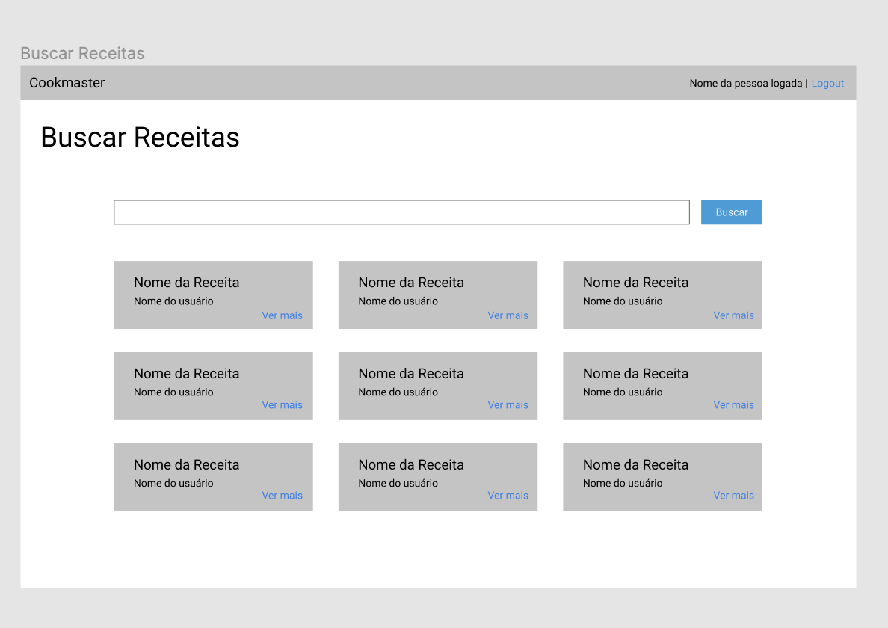

#### As seguintes verificações serão feitas:

**[Verificar se o botão 'Buscar Receitas' redireciona para a página das minhas receitas.]**

**[Validar se consigo fazer uma busca de receita.]**

**[Validar se não possível buscar uma receita que não existe.]**

#### Funções administrativas

> As páginas abaixo só podem ser acessadas fazendo login:

* Cadastro de Receitas
* Edição de Receitas
* Exclusão de Receitas
* Minhas Receitas

> Páginas que **não** podem ser acessadas sem login. Para essas páginas, utilize o `authMiddleware` sem passar parâmetro algum.

### 5 - Crie uma página de cadastro de receitas.

A página deve ser acessível através do endpoint `/recipes/new`, e o formulário deve ser enviado para o endpoint `POST /recipes`

A receita deve ter os campos ID, Nome, Ingredientes, Modo de preparo e Autor. Sinta-se à vontade para modelar o banco da forma que achar melhor. O ID deve ser gerado automaticamente, não devendo ser preenchido no formulário de cadastro de receita.

O campo dos ingredientes terá que ser um campo input onde pode adicionar varios ingredientes e tambem poderá exlcuir ingredientes. Sendo apresentado em uma lista com um botão 'Excluir Ingrediente' para cada ingrediente.

Na Tela inicial('/') acidione o botão 'Nova Receita' deverá conter a tag data-testid="nova-receita", e ao clicar deverá redirecionar para a página de 'Cadastar Receita'. E só poderá ser visualizado caso esteja logado.

Tela de Cadastro de Receita:

O campo input 'Nome da Receita' deverá conter a tag data-testid="nome-receita"

O campo input 'Ingredientes' deverá conter a tag data-testid="ingredientes".

O botao 'Adicionar Ingrediente' deverá conter a tag data-testid="adicionar-ingrediente"

O campo input 'Modo de Preparo' deverá conter a tag data-testid="modo-de-preparo"

O botao 'Salvar Receita' deverá conter a tag data-testid="postar-receita"

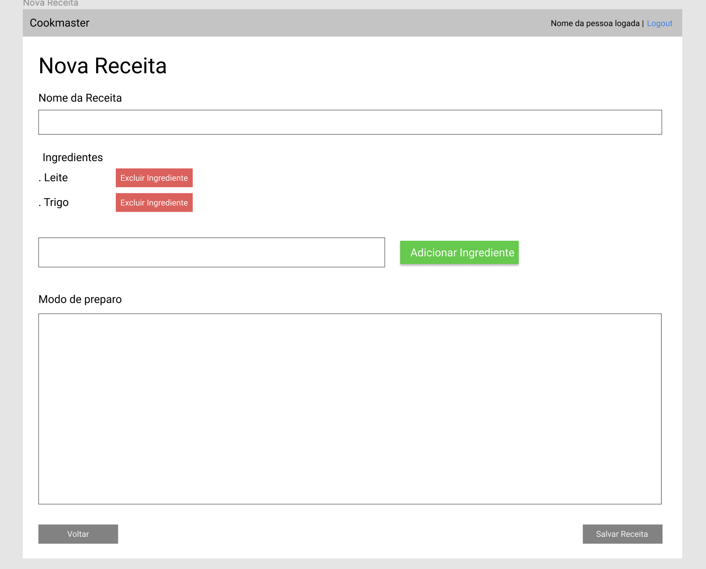

#### As seguintes verificações serão feitas:

**[Verificar se o botão 'Nova Receita' direciona para página de cadastrar receitas.]**

**[Cadastrar uma receita.]**

**[Remover um ingrediente da receita.]**

### 6 - Crie uma página de edição de receitas.

A página deve ser acessível através do endpoint `/recipes/:id/edit`, e o formulário deve ser enviado para o endpoint `POST /recipes/:id`.

Ao carregar, a página já deve conter as informações atuais daquela receita. Você pode utilizar o atributo `value` dos inputs no HTML para preencher esses campos.

Apenas a pessoa que criou a receita deve ter permissão para edita-la. Para verificar isso, você pode utilizar a propriedade `id` localizada em `req.user` (que é criada pelo `authMiddleware`) e compará-la ao ID de quem criou a receita. Caso os IDs não sejam idênticos, a pessoa deve ser redirecionada à página de visualizar receita utilizando o método `res.redirect` no controller.

Caso a edição aconteça com sucesso, a pessoa deve ser redirecionada para a página de visualização daquela receita, já com os dados atualizados.

A validação dos campos deve ser realizada no backend.

**⚠️ Atenção ⚠️**: Lembre-se que a tela não é a única forma de acessar os endpoints. Uma requisição feita utilizando o Postman para o endpoint `POST /recipes/:id` **não deve** alterar o ID da receita ou o nome de quem a cadastrou. Para isso, garanta que não está enviando esses campos ao banco de dados na função de update do seu model de receitas.

Tela de Editar de Receita:

O campo input 'Nome da Receita' deverá conter a tag data-testid="nome-receita"

O campo input 'Ingredientes' deverá conter a tag data-testid="ingredientes".

O botao 'Adicionar Ingrediente' deverá conter a tag data-testid="adicionar-ingrediente"

O campo input 'Modo de Preparo' deverá conter a tag data-testid="modo-de-preparo"

O botao 'Salvar Receita' deverá conter a tag data-testid="postar-receita"

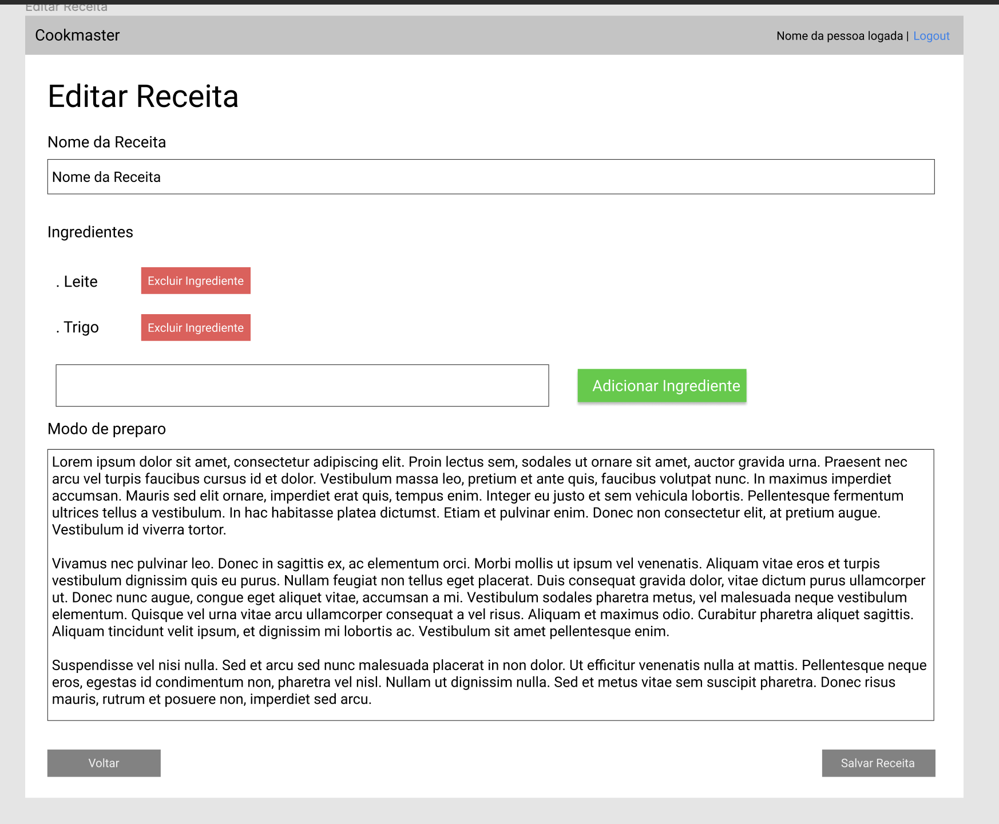

#### As seguintes verificações serão feitas:

**[Editar o nome da receita.]**

**[Editar os ingredientes da receita.]**

**[Editar o modo de preparo da receita.]**

### 7 - Crie uma página de exclusão de uma receita.

A página deve ser acessível através do endpoint `/recipes/:id/delete`, e só pode ser acessada pela pessoa que cadastrou a receita.

Ao acessar a página, um formulário deve ser exibido, solicitando a senha da pessoa para confirmar a operação. Esse formulário deve ser enviado para o endpoint `POST /recipes/:id/delete`.

A receita só deve ser excluída caso a senha esteja correta. Caso ela esteja incorreta, a pessoa deve ser redirecionada à página de exclusão da receita com a mensagem "Senha incorreta.".

Caso a receita seja excluída com sucesso, a pessoa deve ser redirecionada à página de listagem de receitas.

Tela de Excluir Receita:

O campo input 'Senha' deverá conter a tag data-testid="senha" 
O botão 'Confirmar' deverá conter a tag data-testid="confirmar"
O botão 'Cancelar' deverá conter a tag data-testid="cancelar"

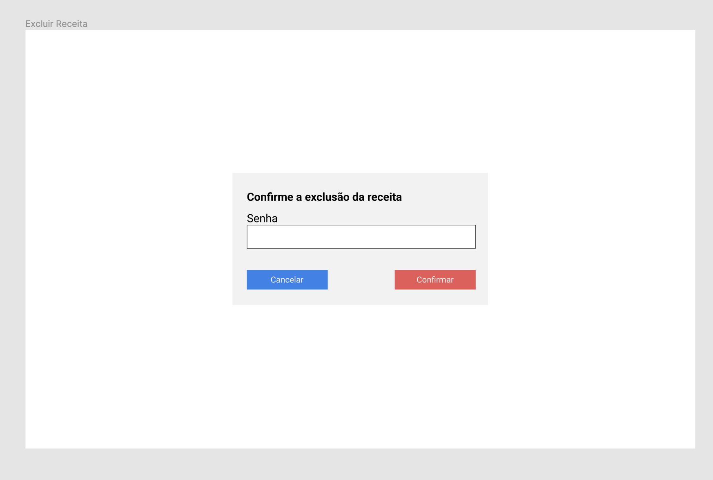

#### As seguintes verificações serão feitas:

**[Tentar excluir uma receita passando a senha errada e verificar a mensagem de erro.]**

Ao inserir a senha errada deverá mostrar a mensagem 'Senha Incorreta.'

**[Excluir receita com sucesso e verificar se foi redirecionada à página de listagem de receitas.]**

### 8 - Crie uma página de "Minhas receitas"

O link para acessar essa página só deve estar visível para pessoas logadas.

A página deve estar acessível através do endpoint `/me/recipes`, e deve renderizar uma lista igual à que é exibida na página de listar receitas, populada com as receitas cadastradas pelo usuário logado.

Caso uma pessoa que não está logada acesse essa página, ela deve ser redirecionada para a tela de login. (O middleware `authMiddleware` já implementa essa funcionalidade, então não se esqueça de utilizá-lo aqui.)

> Lembrete: o ID do usuário logado está disponível em `req.user.id`.

Na Tela inicial('/') acidione o botão 'Minhas Receitas' deverá conter a tag data-testid="minhas-receitas", e ao clicar deverá redirecionar para a página de 'Minhas Receitas'. E só poderá ser visualizado caso esteja logado.

Tela de Minhas Receitas:

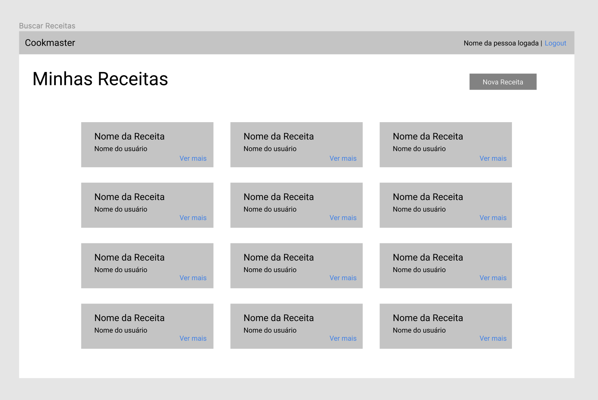

#### As seguintes verificações serão feitas:

**[Validar se o botão minhas receitas está redirecionando para página das minhas receitas.]**

**[Validar se na página está listando as minhas receitas minhas receitas.]**

**[Validar se quando o usuário não está logado tentar acessar a url das minhas receitas seja redirecionado para a tela de login.]**

## Bônus

### 9 - Crie uma página de editar usuário.

O link para acessar essa página só deve estar visível para pessoas logadas.

Cada pessoa só deve poder editar o próprio perfil. Para isso, o backend deve extrair o ID do usuário a ser atualizado da propriedade `req.user`, e não do corpo da request. Esse deve ser o ID enviado ao model para realizar a atualização do usuário.

Esta página deve estar acessível através do endpoint `/me/edit`, e o formulário deve ser enviado para o endpoint `POST /me`.

Caso uma pessoa não logada tente acessar a página, ela deve ser redirecionada para o login. (O middleware `authMiddleware` já implementa essa funcionalidade, então não se esqueça de utilizá-lo aqui.)

O ID da pessoa não deve poder ser editado. Nem através da tela, nem através de uma request realizada pelo Postman. Para isso, garanta que seu model não envia esse campo para o banco de dados.

Na Tela inicial('/') acidione o botão 'Minha Conta' deverá conter a tag data-testid="minha-conta", e ao clicar deverá redirecionar para a página de 'Editar Usuário'. E só poderá ser visualizado caso esteja logado.

Tela de Editar Usuario:

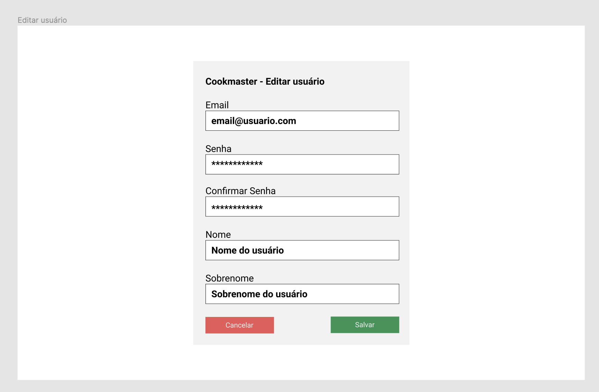

#### As seguintes verificações serão feitas:

**[Verificar se o botão editar usuário redireciona para tela de editar usuário.]**

**[Validar alterar email.]**

**[Validar alterar nome.]**

**[Validar alterar sobrenome.]**

**[Validar alterar senha.]**

---

### DURANTE O DESENVOLVIMENTO

* Faça `commits` das alterações que você fizer no código regularmente

* Lembre-se de sempre após um (ou alguns) `commits` atualizar o repositório remoto

* Os comandos que você utilizará com mais frequência são:
  1. `git status` _(para verificar o que está em vermelho - fora do stage - e o que está em verde - no stage)_
  2. `git add` _(para adicionar arquivos ao stage do Git)_
  3. `git commit` _(para criar um commit com os arquivos que estão no stage do Git)_
  4. `git push -u nome-da-branch` _(para enviar o commit para o repositório remoto na primeira vez que fizer o `push` de uma nova branch)_
  5. `git push` _(para enviar o commit para o repositório remoto após o passo anterior)_

---

### DEPOIS DE TERMINAR O DESENVOLVIMENTO (OPCIONAL)

Para sinalizar que o seu projeto está pronto para o _"Code Review"_ dos seus colegas, faça o seguinte:

* Vá até a página **DO SEU** _Pull Request_, adicione a label de _"code-review"_ e marque seus colegas:

  * No menu à direita, clique no _link_ **"Labels"** e escolha a _label_ **code-review**;

  * No menu à direita, clique no _link_ **"Assignees"** e escolha **o seu usuário**;

  * No menu à direita, clique no _link_ **"Reviewers"** e digite `students`, selecione o time `tryber/students-sd-0x`.

Caso tenha alguma dúvida, [aqui tem um video explicativo](https://vimeo.com/362189205).

---

### REVISANDO UM PULL REQUEST

Use o conteúdo sobre [Code Review](https://course.betrybe.com/real-life-engineer/code-review/) para te ajudar a revisar os _Pull Requests_.

#VQV
